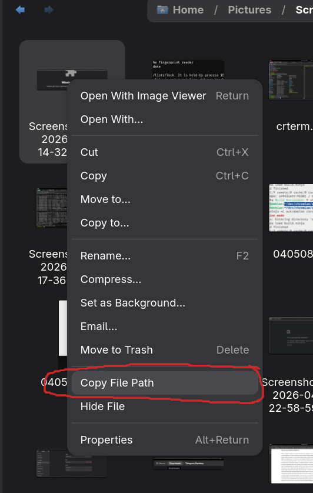

# Nautilus Extension: Copy File Path

这个扩展会给 Nautilus 文件右键菜单增加一个 `Copy File Path` 项。

当前版本按 Nautilus `4.1` / GNOME `50` 环境实现。

点击后会把所选文件或目录的本地路径复制到系统剪贴板：

- 选中 1 个项目时，复制单个绝对路径
- 选中多个项目时，按换行拼接后复制

## 效果截图



## 依赖

Ubuntu / Debian 一般需要：

```bash
sudo apt install python3-nautilus python3-gi
```

## 安装

把扩展文件复制到 Nautilus 的用户扩展目录：

```bash
mkdir -p ~/.local/share/nautilus-python/extensions
cp copy_file_path_extension.py ~/.local/share/nautilus-python/extensions/
```

## 重新加载 Nautilus

```bash
nautilus -q
nautilus &
```

重启后，在文件或目录上右键即可看到 `Copy File Path`。
